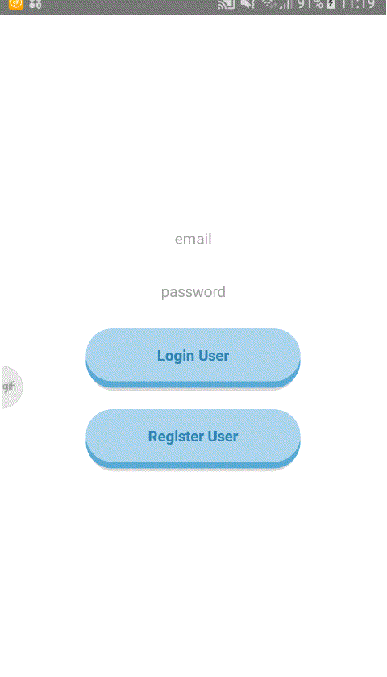

# fullstacking

FullStacking is a project for a [job](https://github.com/FotonTech/join)'s coding challenge that uses React-Native, KoaJS, GraphQL and MongoDB as its stack. It's also the project used in the [FullStacking Series](https://dev.to/heymarkkop/new-challenge-fullstacking-with-react-native-3l55) in which I shared everything I was learning in blog posts.\
The app is a simple event planner with Register/Login and Authentication where users can create events and add them to a common list.\
All forms have validation, there's a datepicker and event's author name is automatically inserted.



## Current state

I've worked in this project for 4 weeks with some breaks.
It still has some workarounds and several pitfalls, but it's a cool first project using GraphQL, a technology I was very curious since I've started working with web development.
I won't maintain this Project for now, as I want to try and practice other technologies.

## Learnings and mentors

I've worked with React Native, GraphQL, Relay, KoaJS, Mongoose and MongoDB and practiced database connections, testing, security and debugging.
I'd like to thanks @jgcmarins, @Thomazella and @jaburcodes for all the help they've given during this project (really, thank you!)

## Posts

1. [New Challenge: Fullstacking with React Native](https://dev.to/heymarkkop/new-challenge-fullstacking-with-react-native-3l55)
2. [Fullstacking: Setting up MongoDB](https://dev.to/heymarkkop/fullstacking-setting-up-mongodb-3oed)
3. [Fullstacking: Setting up React Native](https://dev.to/heymarkkop/fullstacking-setting-up-react-native-1g21)
4. [Fullstacking: Setting up NodeJS + KoaJS](https://dev.to/heymarkkop/fullstacking-setting-up-nodejs-koajs-2jhb)
5. [Fullstacking: Connecting NodeJS ↔ MongoDB](https://dev.to/heymarkkop/fullstacking-connecting-nodejs-mongodb-32l4)
6. [Fullstacking: GraphQL ↔ KoaJS](https://dev.to/heymarkkop/fullstacking-graphql-koajs-273l)
7. [Fullstacking: Restructuring the project](https://dev.to/heymarkkop/fullstacking-restructuring-the-project-3nlm)
8. [Fullstacking: Relay + GraphQL](https://dev.to/heymarkkop/fullstacking-relay-graphql-175j)
9. [Fullstacking: Creating the app](https://dev.to/heymarkkop/fullstacking-creating-the-app-431o)
10. [Fullstacking: Users + Login/Register](https://dev.to/heymarkkop/fullstacking-users-login-register-2l6b)
11. [Fullstacking: Pagination + DataLoader](https://dev.to/heymarkkop/fullstacking-pagination-dataloader-mc2)
12. [Fullstacking: Final Styling](https://dev.to/heymarkkop/fullstacking-final-styling-4028)
13. [Fullstacking: Conclusion](https://dev.to/heymarkkop/fullstacking-conclusion-k4a)

## Requirements

Node, npm, MongoDB, React Native CLI, OpenJDK, Android Studio and AndroidSDK.\
Some of these may differ according to your system. Check my [posts](https://dev.to/heymarkkop/fullstacking-setting-up-react-native-1g21) for instructions.

## Running

```
sudo service mongod start
yarn start:server
yarn start:app
yarn redirect
```

## Helpers

`yarn shake` to simulate a shake and manually reload the app\
`yarn redirect` to redirect ports\
`yarn relay` to generate files need to relay (app only)\
`yarn update-schema` to update graphql.schema (server only, copy to app's graphql.scema)

## Images


